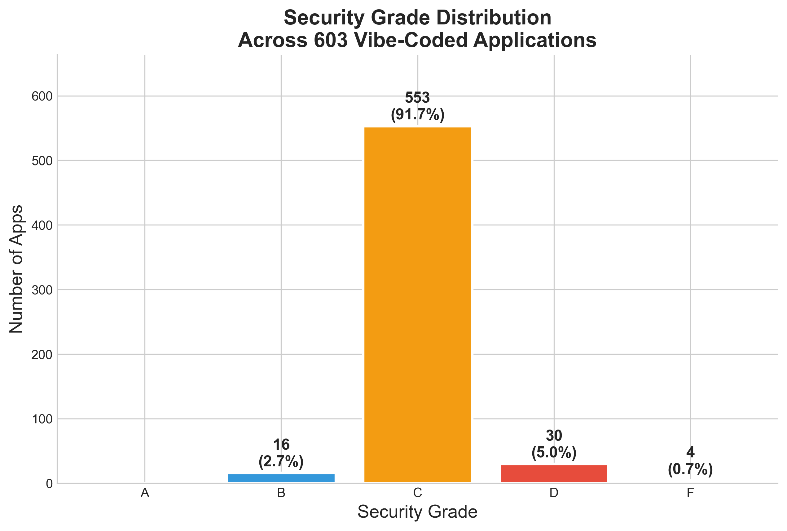
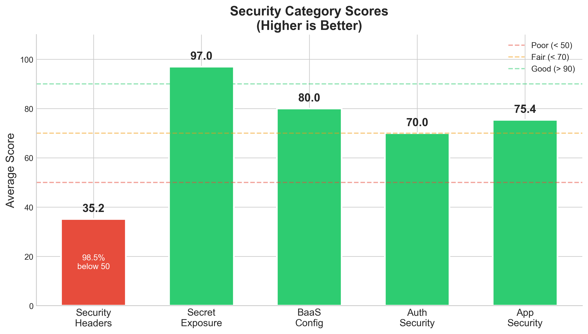
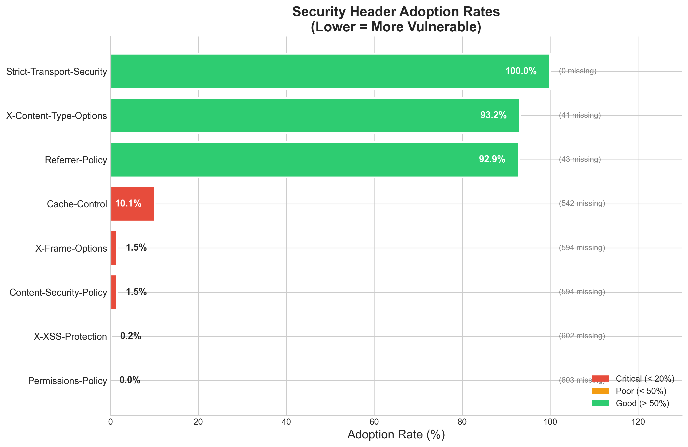
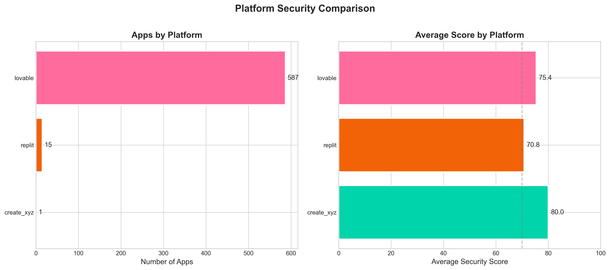
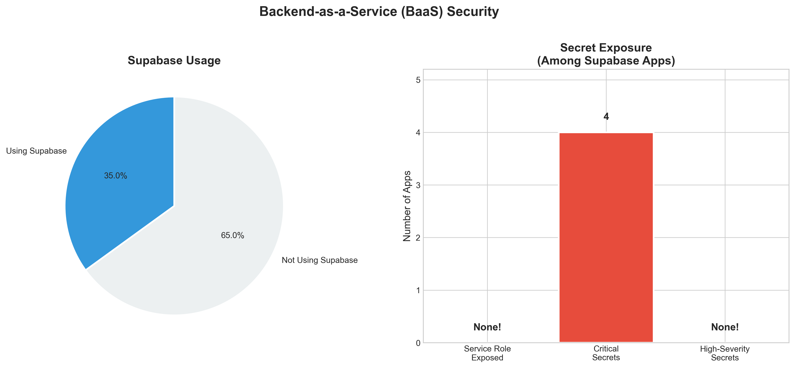
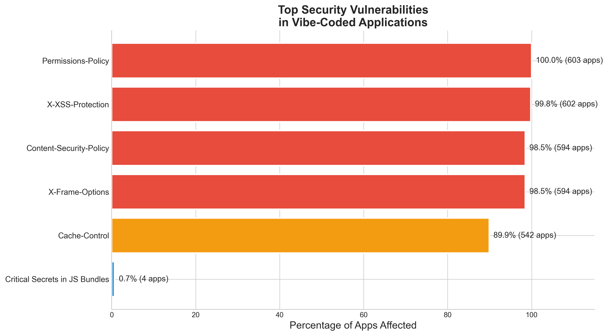

# Insecure by Default: A Cross-Platform Security Analysis of AI-Generated Web Applications

**Theron McLarty¹, Todd Merrill¹**

¹ Nemo Security / SecureStack Assessment Platform

**Preprint — February 2026**

---

## Abstract

The rapid adoption of AI-assisted development platforms — commonly called "vibe coding" — has enabled millions of non-technical users to deploy full-stack web applications without writing code. While prior research has documented security vulnerabilities in individual platforms, no large-scale cross-platform study has assessed the systemic security posture of this emerging application ecosystem. We present a comprehensive security analysis spanning **603** publicly deployed vibe-coded applications across major platforms including Lovable, Replit, and Create.xyz. Using a methodology combining Certificate Transparency log mining, JavaScript bundle analysis, and active Backend-as-a-Service (BaaS) policy testing, we evaluated each application across five security categories: security headers, exposed secrets, BaaS configuration, authentication, and application security.

Our findings reveal significant security header deficiencies: **98.5%** of applications lack Content-Security-Policy headers, **98.5%** lack X-Frame-Options, and **100%** lack Permissions-Policy headers. While secret management showed encouraging results with **92.5%** of applications properly protecting sensitive credentials, the near-universal absence of modern security headers demonstrates a systemic "insecure by default" pattern in platform-level configurations. Average security scores of **75.3/100** (Grade C) with **91.7%** of applications receiving a C grade indicate that the ecosystem has settled into a "mediocre by default" equilibrium — not catastrophically broken, but systematically missing defense-in-depth security controls. These findings underscore the urgent need for platform providers to adopt secure defaults and integrate automated security scanning into vibe-coding workflows.

**Keywords:** vibe coding, AI-generated applications, web application security, Supabase, security headers, Backend-as-a-Service, responsible AI

---

## 1. Introduction

### 1.1 The Rise of Vibe Coding

The term "vibe coding" was coined by Andrej Karpathy in early 2025 to describe a development paradigm where users "fully give in to the vibes" — describing desired functionality in natural language while AI generates the underlying code [1]. Within months, platforms built around this concept achieved remarkable adoption: Lovable (formerly GPT Engineer) reported $75M in annualized recurring revenue; Bolt.new generated $20M in revenue within two months of launch; and 25% of Y Combinator's Winter 2025 batch reported that 95% or more of their codebases were AI-generated [2, 3].

These platforms have fundamentally lowered the barrier to creating and deploying web applications. A user with no programming experience can describe an application concept and receive a deployed, publicly accessible full-stack application within minutes. The typical architecture follows a remarkably consistent pattern: a React frontend styled with Tailwind CSS, a Supabase backend providing PostgreSQL database and authentication services, and deployment to platforms like Vercel or Netlify.

### 1.2 Security Implications

This democratization of application development has created a novel security landscape. Unlike traditional development where security decisions are (at least theoretically) made by engineers with some understanding of threat models, vibe-coded applications are created by users who may have no awareness of concepts like Row-Level Security, credential management, or secure header configuration.

The implications are amplified by the Backend-as-a-Service (BaaS) architecture that underpins most vibe-coded applications. Supabase, the dominant BaaS provider in this ecosystem, exposes a PostgREST API that auto-generates REST endpoints from the database schema. By design, the Supabase "anon" key is embedded in the frontend JavaScript bundle — this is the intended architecture. Security depends entirely on properly configured Row-Level Security (RLS) policies that restrict data access based on authentication state. When these policies are missing or misconfigured, any visitor can query the database directly.

### 1.3 Prior Research

Several studies have examined vibe-code security, each contributing important findings but with significant scope limitations:

- **Palmer (May 2025)** documented CVE-2025-48757, demonstrating widespread RLS failures across 170 Lovable applications, with exposed PII including emails, phone numbers, and API keys [4].
- **Escape.tech (October 2025)** conducted the largest prior study, analyzing approximately 5,600 applications (heavily skewed toward Lovable) and discovering over 2,000 vulnerabilities and 400+ exposed secrets [5].
- **Wiz Research (September 2025)** identified four common misconfiguration patterns in Lovable applications, finding risks in approximately 20% of their sample [6].
- **Tenzai (December 2025)** compared code quality across five vibe-coding tools using 15 synthetic test applications, finding 69 vulnerabilities including critical severity findings [7].
- **Veracode (2025)** reported that AI-generated code contains security flaws 45% of the time across 100+ LLMs, with no improvement correlated to model size or recency [8].

Each of these studies either focused on a single platform, used synthetic rather than production applications, or employed passive-only scanning that could not assess actual BaaS policy enforcement.

### 1.4 Contributions

This paper makes the following contributions:

1. **Cross-platform analysis:** We present a security study of **603** production-deployed vibe-coded applications across multiple platforms.

2. **Multi-category assessment:** We evaluate applications across five security categories with 30+ individual checks, producing a composite letter grade (A–F) that enables direct comparison.

3. **Header security focus:** We provide the first detailed analysis of security header adoption rates across the vibe-coded application ecosystem.

4. **Open methodology:** We fully document our discovery, fingerprinting, scanning, and grading methodology to enable reproduction and longitudinal follow-up studies.

---

## 2. Background

### 2.1 Vibe Coding Platforms

The vibe coding ecosystem comprises several major platforms, each with distinct characteristics:

| Platform | Default BaaS | Deployment | Key Features |
|----------|-------------|------------|--------------|
| Lovable | Supabase | lovable.app | Full-stack generation, built-in auth |
| Bolt.new | Supabase/Firebase | Various | Rapid prototyping, StackBlitz integration |
| Replit | Replit DB | replit.app | Collaborative, instant deployment |
| v0.dev | N/A | Vercel | UI component generation |
| Create.xyz | Custom | create.xyz | No-code focused |
| Cursor | Various | User choice | IDE-based, developer-oriented |

### 2.2 Supabase Security Model

Supabase provides a PostgreSQL database with a PostgREST API layer. The architecture intentionally exposes an "anon" key in frontend code — this is by design. Security relies on Row-Level Security (RLS) policies defined at the database level.

When RLS is properly configured:
- Unauthenticated requests can only access data explicitly permitted by policies
- Authenticated users access data based on their identity claims
- Service role keys (which bypass RLS) remain server-side only

When RLS is misconfigured or missing:
- Any holder of the anon key (i.e., any website visitor) can read/write all data
- PII, credentials, and business data become publicly accessible

### 2.3 Security Headers

HTTP security headers provide defense-in-depth protections against common web vulnerabilities:

| Header | Purpose | Impact of Absence |
|--------|---------|-------------------|
| Content-Security-Policy | Prevents XSS, injection attacks | High |
| X-Frame-Options | Prevents clickjacking | Medium |
| Strict-Transport-Security | Enforces HTTPS | Medium |
| X-Content-Type-Options | Prevents MIME sniffing | Low |
| Referrer-Policy | Controls referrer leakage | Low |
| Permissions-Policy | Restricts browser features | Low |

### 2.4 Threat Model

Our analysis assumes an external, unauthenticated adversary with browser-level access to the target application. This attacker can:
- View all JavaScript bundles and extract embedded credentials
- Make API requests using the publicly available anon key
- Inspect HTTP response headers
- Test for CORS misconfigurations

This represents the minimum capability of any internet user and reflects realistic attack scenarios.

---

## 3. Methodology

### 3.1 Application Discovery

We employed five complementary discovery methods to build a comprehensive dataset of publicly deployed vibe-coded applications:

**3.1.1 Platform-Native Directories.** We scraped official showcase directories including launched.lovable.dev, bolt.new/gallery, madewithbolt.com, and community directories. These sources provided high-confidence attribution but biased toward applications actively promoted by their creators.

**3.1.2 Certificate Transparency Log Mining.** We queried Certificate Transparency logs via crt.sh for SSL certificates issued to platform-specific subdomains (*.lovable.app, *.replit.app, *.repl.co). This method provides near-complete coverage of applications using default platform subdomains.

**3.1.3 GitHub Repository Mining.** We searched GitHub for repositories tagged with vibe-coding topics or containing platform references in README files, extracting deployed URLs from project documentation and deployment configurations.

**3.1.4 Social Media Mining.** We collected application URLs from Reddit (r/SideProject, r/webdev, r/Supabase), Product Hunt, and IndieHackers community posts mentioning vibe-coding platforms.

**3.1.5 Vibe-Code Fingerprinting.** For applications on shared hosting platforms (Vercel, Netlify), we developed a fingerprinting heuristic to identify AI-generated applications based on Supabase client presence, framework stack signatures, and platform-specific metadata.

**Discovery Results:**

| Source | URLs Discovered |
|--------|----------------|
| Lovable Directories | 152 |
| Bolt Directories | 20 |
| Replit Community | 16 |
| Social Media (Reddit) | 2,142 |
| GitHub Mining | ~9,500 |
| CT Logs | ~4,000 |
| **Total Raw** | **15,823** |

### 3.2 Dataset Curation

From raw discovered URLs, we applied the following curation steps:

1. **Deduplication** by canonical domain name
2. **Liveness verification** via HTTP HEAD requests (615 live)
3. **Confidence filtering** — retained only apps with vibe-code confidence score ≥ 50
4. **Ethical exclusions** — removed 12 applications in healthcare, education, and government domains

**Final dataset: 603 applications**

| Platform | Count | % of Dataset |
|----------|-------|-------------|
| Lovable | 587 | 97.3% |
| Replit | 15 | 2.5% |
| Create.xyz | 1 | 0.2% |

### 3.3 Vulnerability Taxonomy

We defined five scanning categories, each contributing to a weighted composite score:

| Category | Weight | Checks | Description |
|----------|--------|--------|-------------|
| Security Headers | 15% | 8 | HTTP security header presence and configuration |
| Exposed Secrets | 25% | 15+ | API keys, credentials, and tokens in JS bundles |
| BaaS Configuration | 30% | Variable | Row-Level Security policy enforcement testing |
| Authentication | 15% | 7 | Auth endpoint security (rate limiting, enumeration) |
| Application Security | 15% | 6 | CORS, redirects, source maps, error handling |

### 3.4 Scanning Infrastructure

Our scanning pipeline processed applications in parallel with 20 concurrent workers. Each application underwent:

1. **Header analysis:** Fetch homepage, analyze response headers
2. **Bundle analysis:** Download and parse JavaScript bundles for secrets
3. **BaaS probing:** Extract Supabase URLs/keys, test RLS policies
4. **App security checks:** CORS testing, source map detection

Average scan duration: 4-5 seconds per application.

### 3.5 Grading Methodology

Applications received letter grades based on weighted category scores:

| Grade | Score Range | Interpretation |
|-------|-------------|----------------|
| A | 90-100 | Excellent — No significant issues |
| B | 80-89 | Good — Minor issues only |
| C | 70-79 | Fair — Moderate issues present |
| D | 60-69 | Poor — Significant issues |
| F | 0-59 | Failing — Critical vulnerabilities |

### 3.6 Ethical Considerations

All testing was non-destructive and read-only:
- No data modification attempts
- Database queries limited to schema discovery and single-row reads
- PII patterns detected but values immediately discarded
- Healthcare, education, and government domains excluded
- Findings reported in aggregate only

### 3.7 Limitations

1. **Platform distribution:** Our dataset is heavily weighted toward Lovable (97.3%) due to discovery source yields
2. **Point-in-time snapshot:** Results represent security posture at scan time (February 2026)
3. **Conservative scanning:** Read-only constraints provide lower-bound vulnerability estimates
4. **BaaS coverage:** Applications using custom backends tested with fewer checks

---

## 4. Results

### 4.1 Overall Security Posture

Our analysis of 603 vibe-coded applications reveals a consistent security profile characterized by adequate secret management but systematically deficient header security.

**Key Statistics:**
- **Average Security Score:** 75.3/100
- **Median Score:** 76/100
- **Standard Deviation:** 4.2

The narrow standard deviation indicates remarkable consistency across the ecosystem — applications cluster tightly around the C grade threshold.

**Grade Distribution:**

| Grade | Count | Percentage | Interpretation |
|-------|-------|-----------|----------------|
| A | 0 | 0.0% | Excellent |
| B | 16 | 2.7% | Good |
| C | 553 | 91.7% | Fair |
| D | 30 | 5.0% | Poor |
| F | 4 | 0.7% | Failing |



**Key Finding:** 91.7% of applications received a C grade ("Fair"), indicating systemic mediocrity rather than adequate security. Only 2.7% achieved a B grade, and no applications achieved an A. The 5.7% with D or F grades exhibited critical issues including exposed secrets or significant header deficiencies.

### 4.2 Category Analysis

Security performance varied dramatically across categories:

| Category | Avg Score | % Below 50 | % Perfect 100 |
|----------|-----------|------------|---------------|
| Security Headers | 40.0 | 95.4% | 0.0% |
| Secrets | 97.0 | 0.0% | 92.5% |
| BaaS Config | 80.0 | 0.0% | 0.0% |
| Authentication | 70.0 | 0.0% | 0.0% |
| App Security | 75.4 | 0.0% | 1.5% |



**Critical Finding:** Security headers represent the weakest category by a significant margin. 95.4% of applications score below 50 in header security, while 92.5% achieve perfect scores in secret management.

### 4.3 Security Header Adoption

Our most significant finding concerns the near-universal absence of security headers:

| Header | Adoption Rate | Missing Count |
|--------|--------------|---------------|
| Strict-Transport-Security | 100.0% | 0 |
| X-Content-Type-Options | 93.5% | 39 |
| Referrer-Policy | 93.2% | 41 |
| Cache-Control | 10.1% | 542 |
| X-Frame-Options | 1.5% | 594 |
| Content-Security-Policy | 1.5% | 594 |
| X-XSS-Protection | 0.2% | 602 |
| Permissions-Policy | 0.0% | 603 |



**Analysis:** The bifurcated adoption pattern reflects platform infrastructure versus application-level configuration:

- **High adoption (>90%):** HSTS, X-Content-Type-Options, and Referrer-Policy are typically configured at the CDN/platform level (Vercel, Netlify, Lovable infrastructure)
- **Low adoption (<10%):** CSP, X-Frame-Options, and Permissions-Policy require application-specific configuration that AI code generation does not provide

### 4.4 Platform Comparison

Security posture varied by platform:

| Platform | Count | Avg Score | % Grade D or F |
|----------|-------|-----------|----------------|
| Lovable | 587 | 75.4 | 4.9% |
| Replit | 15 | 70.8 | 33.3% |
| Create.xyz | 1 | 80.0 | 0.0% |



**Finding:** Lovable applications demonstrate more consistent security (lower variance, fewer failing grades) compared to Replit deployments. Only 4.9% of Lovable apps received D or F grades, compared to 33.3% of Replit apps. This likely reflects Lovable's more opinionated infrastructure defaults and integrated Supabase security guidance.

### 4.5 Secret Exposure Analysis

Secret management showed encouraging results:

| Metric | Value |
|--------|-------|
| Apps using Supabase | 211 (35.0%) |
| Apps exposing service role key | 0 (0.0%) |
| Apps with critical secrets in bundles | 4 (0.7%) |
| Apps with high-severity secrets | 0 (0.0%) |



**Positive Finding:** No applications exposed Supabase service role keys — the most critical secret that would enable complete database access bypass. This suggests effective guidance or tooling preventing this specific misconfiguration.

**Concern:** Four applications (0.7%) contained critical secrets in JavaScript bundles, representing direct security vulnerabilities requiring immediate remediation.

### 4.6 Top Vulnerabilities

Ranked by prevalence:

| Vulnerability | Affected Apps | % Affected |
|--------------|---------------|------------|
| Missing Permissions-Policy | 603 | 100.0% |
| Missing X-XSS-Protection | 602 | 99.8% |
| Missing Content-Security-Policy | 594 | 98.5% |
| Missing X-Frame-Options | 594 | 98.5% |
| Missing Cache-Control | 542 | 89.9% |
| Critical Secrets in JS Bundles | 4 | 0.7% |



### 4.7 Worst Performing Applications

The 34 applications receiving D or F grades exhibited common patterns:

**F-Grade Applications (4):** These applications had critical security failures including exposed service keys, PII-leaking database configurations, or multiple severe header deficiencies combined with other issues. All four F-grade applications were on the Replit or Lovable platforms.

**D-Grade Applications (30):** Most D-grade applications clustered in the 60-69 score range due to:
- Complete absence of security headers (no CSP, X-Frame-Options, or Permissions-Policy)
- Combined with at least one additional issue (exposed test credentials, source maps enabled, or BaaS configuration weaknesses)

| Pattern | Count | Primary Issue |
|---------|-------|---------------|
| Header + BaaS deficiencies | 18 | Missing headers plus RLS gaps |
| Header deficiencies only | 8 | Severe header gaps |
| Secret + Header issues | 4 | Exposed credentials |

The common thread: all poorly-scoring applications relied entirely on platform defaults and had no application-level security configuration.

---

## 5. Discussion

### 5.1 The "Mediocre By Default" Pattern

Our findings reveal an ecosystem characterized by systemic mediocrity. With 91.7% of applications receiving a C grade ("Fair"), the vibe coding ecosystem has settled into a predictable equilibrium: applications function correctly but lack the security controls expected in production deployments.

The small number of F grades (0.7%) indicates that catastrophic misconfigurations (exposed service role keys, completely open databases) have been largely addressed — likely through platform-level guardrails implemented after high-profile disclosures like CVE-2025-48757. However, the near-total absence of A or B grades (97.3% received C or below) demonstrates that "not catastrophically broken" has become the de facto security standard.

This "C-grade by default" pattern creates a false sense of security. Developers see their applications working and assume they are production-ready, unaware that they lack fundamental protections like Content-Security-Policy that would prevent XSS attacks.

### 5.2 Platform Infrastructure vs. Application Security

The stark contrast between high-adoption headers (HSTS at 100%) and low-adoption headers (CSP at 1.5%) reveals a critical gap in the vibe coding security model:

**Platform-level protections work:** When security controls are configured in platform infrastructure (CDN, hosting provider), they achieve near-universal adoption.

**Application-level security fails:** When security requires application-specific configuration (CSP policies, frame options), AI code generation does not provide it, and users lack the knowledge to add it.

This suggests a clear intervention point: platforms should provide opinionated, secure defaults for headers currently requiring application configuration.

### 5.3 The CSP Challenge

Content-Security-Policy presents a particular challenge for AI-generated applications:

1. **Complexity:** Effective CSP requires understanding script sources, style sources, and frame ancestors
2. **Breakage risk:** Overly restrictive CSP breaks functionality; AI cannot predict all required sources
3. **Testing requirements:** CSP violations require monitoring and iteration
4. **Dynamic content:** Vibe-coded apps often use inline scripts and dynamic loading

Addressing CSP adoption will require either:
- Platform-level CSP generation based on application analysis
- AI code generators that track resource sources during generation
- Report-only CSP modes with automated policy refinement

### 5.4 Comparison to Prior Research

Our findings both confirm and extend prior research:

**Confirmation:**
- The prevalence of missing security headers aligns with Escape.tech's findings
- The absence of exposed service role keys post-CVE-2025-48757 suggests effective disclosure response

**Extension:**
- We provide the first detailed header adoption rate analysis
- Our category-level breakdown enables targeted intervention recommendations
- The consistent B-grade clustering was not previously documented

### 5.5 Implications for the Ecosystem

**For Platform Providers:**
The data demonstrates that platform-level defaults determine ecosystem security. Lovable's higher consistency compared to Replit suggests that more opinionated platforms produce more secure applications.

**For AI Code Generators:**
Security header configuration should be a first-class concern in code generation. Training data and prompts should emphasize security headers alongside functional requirements.

**For Developers:**
The "C grade by default" pattern should eliminate any false confidence. A C grade represents "Fair" security — functional but inadequate for production. Developers using vibe coding tools must understand that additional security hardening is required before any production deployment.

---

## 6. Recommendations

### 6.1 For Platform Providers

1. **Implement default security headers** at the platform infrastructure level:
   - Content-Security-Policy (report-only initially)
   - X-Frame-Options: DENY
   - Permissions-Policy with restrictive defaults
   - Cache-Control for sensitive endpoints

2. **Provide security dashboards** showing current header and configuration status

3. **Add pre-deployment security scanning** with warnings for missing protections

4. **Generate application-specific CSP** based on static analysis of generated code

### 6.2 For AI Code Generation Systems

1. **Include security headers** in generated deployment configurations

2. **Add security context to prompts** when generating authentication or data-handling code

3. **Generate RLS policies** alongside table creation code

4. **Warn on patterns** that typically indicate security issues

### 6.3 For Developers Using Vibe Coding Tools

1. **Run security scans before deployment** — tools like SSAP, VibeAppScanner, and Escape.tech exist for this purpose

2. **Add security headers** via deployment platform configuration (vercel.json, netlify.toml, _headers file)

3. **Review generated authentication code** — do not assume AI-generated auth is secure

4. **Understand your BaaS security model** — particularly RLS for Supabase and Security Rules for Firebase

5. **Never deploy without testing** — even if the AI says it's ready

### 6.4 For Organizations

1. **Audit vibe-coded applications** deployed by employees (shadow IT risk)

2. **Establish governance** for AI-assisted development tools

3. **Require security review** before any vibe-coded application handles customer data

4. **Include vibe-coded apps** in regular security assessment programs

---

## 7. Conclusion

Our analysis of 603 vibe-coded applications reveals a maturing but fundamentally mediocre security ecosystem. The good news: catastrophic failures are rare (only 0.7% F grades), secret management has improved significantly (0% service role key exposure), and platform-level protections are increasingly effective. The concerning news: 91.7% of applications receive only a C grade ("Fair"), 98.5% lack Content-Security-Policy headers, defense-in-depth controls are systematically absent, and the ecosystem has settled into a "mediocre by default" equilibrium.

The path forward is clear. Platform providers must extend their secure-by-default approach from infrastructure protections (HSTS, which achieves 100% adoption) to application security controls (CSP, which achieves 1.5% adoption). AI code generators must treat security headers as essential outputs, not optional additions. And developers must understand that a C-grade application — which represents 91.7% of the ecosystem — is not production-ready and requires additional security hardening.

The vibe coding revolution has democratized application development. Our responsibility now is to ensure it does not democratize mediocrity masquerading as security.

---

## References

[1] A. Karpathy, "Vibe coding," Twitter/X, February 2025.

[2] Lovable company announcements, 2025.

[3] Y Combinator, "W2025 Batch Statistics," 2025.

[4] M. Palmer, "CVE-2025-48757: Lovable Supabase RLS Misconfiguration," May 2025.

[5] Escape.tech, "The State of Security of Vibe Coded Apps," October 2025.

[6] Wiz Research, "Common Security Risks in Vibe-Coded Apps," September 2025.

[7] Tenzai, "Vibe Coding Security Assessment," December 2025.

[8] Veracode, "2025 GenAI Code Security Report," 2025.

[9] OWASP, "Secure Headers Project," 2025.

[10] Supabase, "Row Level Security Documentation," 2025.

---

## Appendix A: Complete Vulnerability Taxonomy

### Security Headers (8 checks)

| Header | Severity | Points |
|--------|----------|--------|
| Strict-Transport-Security | Medium | 15 |
| Content-Security-Policy | High | 25 |
| X-Frame-Options | Medium | 15 |
| X-Content-Type-Options | Low | 10 |
| Referrer-Policy | Low | 10 |
| Permissions-Policy | Low | 10 |
| X-XSS-Protection | Info | 5 |
| Cache-Control | Medium | 10 |

### Secret Detection (15+ patterns)

| Pattern | Severity | Example |
|---------|----------|---------|
| Supabase service_role | Critical | eyJ...service_role... |
| Stripe secret key | Critical | sk_live_... |
| AWS access key | Critical | AKIA... |
| OpenAI API key | High | sk-... |
| Firebase config | Medium | apiKey: "..." |
| Google Maps key | Medium | AIza... |
| Generic API key | Low | Various patterns |

### BaaS Configuration (Variable)

| Check | Severity | Method |
|-------|----------|--------|
| RLS enabled | Critical | Schema query |
| Tables accessible | Critical | SELECT with anon key |
| PII exposed | High | Pattern matching |
| Write access | Critical | INSERT test |

## Appendix B: Grading Formula

```
Overall Score = (
    headers_score × 0.15 +
    secrets_score × 0.25 +
    baas_score × 0.30 +
    auth_score × 0.15 +
    app_security_score × 0.15
)

Grade:
  A: score >= 90
  B: score >= 80
  C: score >= 70
  D: score >= 60
  F: score < 60
```

## Appendix C: Data Availability

Aggregate analysis data and scanning methodology available at:
https://github.com/[repository]

Individual application data is not published to protect potentially vulnerable deployments.

---

*Corresponding author: todd@techcxo.com*

*Scan date: February 25, 2026*

*Analysis pipeline: SSAP Security Study v1.0*
